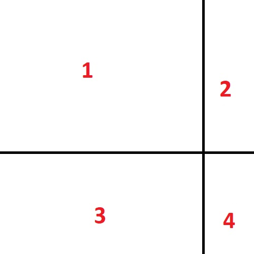

Documentation 
=================
### In Depth Explaination of Concepts and each Functions
<u>Step 1:</u>
```python
def slice_img_by_borders() 
```
Here, we sliced the image into 4 pieces according to the parameters given.
<p align="center">
  
</p>
<br>

<u>Step 2:</u>
```python
def slice_img_around_vertical_borders()
```
Here, for every line of vertical border in Step 1, we create a surrounding region around the line. The width of that surounding area should be slightly more than 2 times the width of object. The height should not exceed the max height of the piece.

<p align="center">
  
</p>
<br>

<u>Step 3:</u>
```python
def slice_img_around_horizontal_borders()
```
Now, we do the same for all the lines of horizontal border with same condition now applied to width.
<p align="center">
  
</p>
<br>

<u>Step 4:</u>
```python
def slice_img_around_intersection_of_borders()
```
Lastly, we now take every intersection points of horizontal border lines and vertical border lines. In the previous case, we only have one intersection points. Take the surrounding area of that intersection points. The dimension of area taken should be slightly more than 2 times the width of object and 2 times the height of object.
<p align="center">
  
</p>
<br>